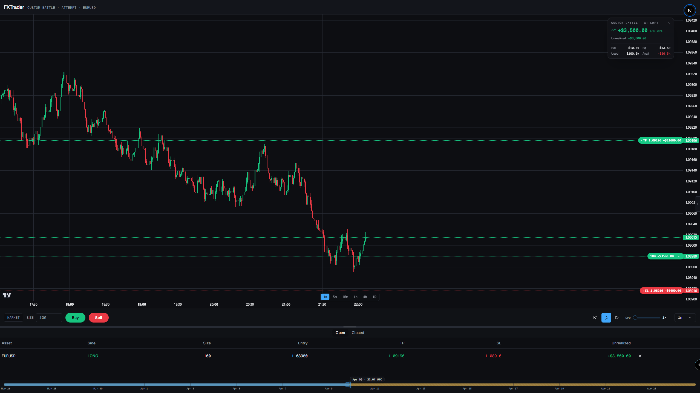

# FXTrader

> Replay historical markets, sharpen your edge.

Desktop-first single-user web application. Replay historical bars
candle-by-candle and place simulated trades against price action. Browser-only
— no backend, no auth, no cloud.

The full product specification lives at [`../CLAUDE.md`](../CLAUDE.md). This
README is the developer-facing companion: how to run the repo, how the parts
fit together, where things live.



> Screenshot not committed yet. See [`SCREENSHOT.md`](SCREENSHOT.md) for capture
> instructions if regenerating.

---

## 1. What FXTrader is

FXTrader is a deterministic single-player trading replay simulator. It loads
30 days of 1-minute bars per instrument (EURUSD, GBPUSD, USDJPY, NQ1!, ES1!),
ticks them through a `ReplayEngine` clock at 1× to 16× speed, and matches
user-submitted orders against bar action via a pure `MatchingEngine`. Sessions,
trades, and battles persist to IndexedDB via Dexie. Charts use Lightweight
Charts; analytics use Recharts. Spec: [`CLAUDE.md`](../CLAUDE.md).

## 2. Quick start

```bash
pnpm install
pnpm fetch-data        # build synthetic 1m datasets into public/data/
pnpm dev               # http://localhost:3000
```

Then open the dashboard and click **Start new session**.

Optional flags:

```bash
pnpm fetch-data --real            # try real Dukascopy + Yahoo, fall back to synthetic on failure
pnpm fetch-data --real-window=25  # tighter window if Yahoo's 30-day cap is hitting
pnpm test                          # 99 unit tests (engine, analytics, battle guards)
pnpm typecheck                     # tsc --noEmit
pnpm lint                          # eslint
pnpm build                         # production Next.js build
pnpm smoke                         # console-only end-to-end engine smoke test
```

Scripts kept around as regression checks (do not delete in cleanup):

```bash
npx tsx scripts/sample-analytics.ts          # dashboard analytics on seeded data
npx tsx scripts/sample-battle-analytics.ts   # leaderboard on seeded battle/attempts
```

## 3. Loading more historical data

**Synthetic (default).** `pnpm fetch-data` runs offline and produces
byte-identical output across machines (deterministic LCG seeded from
`SYNTHETIC_SEED = 0x46585452`). Fixed window anchored to
`WINDOW_END_ISO = 2026-04-24T22:00:00Z`, 30 days back. Forex sessions skip
weekends; futures sessions honor CME RTH+ETH with the daily 21:00–22:00 UTC
maintenance break. See [`scripts/fetch-sample-data.ts`](scripts/fetch-sample-data.ts).

**Real (opt-in).** `pnpm fetch-data --real` uses a rolling now-30d window and
attempts:

| Source | Used for |
|---|---|
| `dukascopy-node` | Forex (EURUSD, GBPUSD, USDJPY) |
| `yahoo-finance2` | Futures (NQ1!, ES1!) |

Per-instrument fallback to synthetic on any failure. The manifest records
`source` so you can tell which is which.

**Manual CSV import** is scaffolded but not built in v1. The path forward
is `Settings → Import Data` accepting Dukascopy-format CSVs, persisted via
`barRepository.bulkInsert()`. Tracked as v1.1 per spec §7.

## 4. How the replay engine works

Detailed in spec [§5](../CLAUDE.md#5-the-replay-engine-heart-of-the-app) and
[§6](../CLAUDE.md). Quick orientation:

- **`ReplayEngine`** ([`src/lib/engine/ReplayEngine.ts`](src/lib/engine/ReplayEngine.ts))
  is a class that owns a `Bar[]` array and a simulated clock. Recursive
  `setTimeout` (not `setInterval`) so speed changes apply immediately.
  Pause waits for the current tick to drain. Subscribers receive
  `ReplayEvent`s (`bar`, `play`, `pause`, `seek`, `speed`, `end`, `load`).

- **`MatchingEngine.processBar()`** ([`src/lib/engine/MatchingEngine.ts`](src/lib/engine/MatchingEngine.ts))
  is a pure function: in → `{bar, pendingOrders, openPositions, instrument}`,
  out → `{fills, closures, rejections, liquidated}`. Defensive temporal
  guards skip TP/SL closures and order fills for bars before
  `pos.entryTime` / `order.createdAt` so scrub-back doesn't
  retroactively trigger.

- **The seam.** `app/providers.tsx` subscribes to engine `bar` events,
  runs `processBar` on the orderStore + sessionStore current state, applies
  the result back through `orderStore.applyBarResult()` and
  `sessionStore.applyBarSettlement()`. Forward-only: `lastProcessedIndex`
  guards against re-processing on backward scrub. The chart's own subscriber
  attaches *after* providers' so fills appear in the position table the
  same frame the bar paints.

- **Spec deviations worth knowing**:
  - Market orders fill *immediately* at the current bar's close, not the
    next bar's open (§6 says next-bar; UX wins here).
  - Manual close (clicking X on a position) closes immediately at current
    bar close, not next-bar-open.

## 5. TradingView Trading Platform upgrade path

Full prerequisites + application process: [spec §18](../CLAUDE.md#18-path-to-tradingview-trading-platform-future-optional).

The architecture deliberately makes this a contained swap. Once you have an
approved license + the private repo:

```text
1. Add the private repo as a submodule (or copy library files into
   public/charting_library/). Both folders are already in .gitignore.
2. Create src/components/chart/TradingPlatformProvider.tsx that implements
   the existing ChartProviderHandle interface from
   src/components/chart/ChartProvider.types.ts.
3. The DataProvider interface (src/lib/data/DataProvider.ts) is already
   UDF-shaped — the BundledDataProvider becomes the datafeed implementation
   passed to the Trading Platform widget. Promise → callback adapter on the
   surface, otherwise unchanged.
4. Replace the import in src/components/chart/ChartContainer.tsx:
   - import { createLightweightChart } from "./LightweightChartProvider";
   + import { createTradingPlatformChart } from "./TradingPlatformProvider";
5. Remove now-redundant components (in-chart trading subsumes some of these):
   - src/components/chart/overlays/PositionDragOverlay.tsx
     (TP/SL drag is native in Trading Platform)
   - PositionLine.ts (priceLines are native)
6. Update README's quick-start to note: after clone, drop charting_library/
   from your private TV repo into public/ before pnpm dev.
```

Reference repos to consult before the swap:

- <https://github.com/tradingview/charting-library-tutorial>
- <https://github.com/tradingview/charting-library-examples/tree/master/nextjs>

## 6. Keyboard shortcuts

Active only on `/trade/*` routes. Disabled when focus is inside an input/
textarea/select. Source: [`src/hooks/useKeyboardShortcuts.ts`](src/hooks/useKeyboardShortcuts.ts).

| Key | Action |
|---|---|
| `Space` | Play / Pause |
| `←` / `→` | Step bar back / forward (uses `stepMinutes` from replayStore) |
| `1` `2` `3` `4` `5` | Speed 1× / 2× / 4× / 8× / 16× |
| `B` | Open Buy dialog (PlaceOrderDialog) |
| `S` | Open Sell dialog |
| `M` | One-click market buy at default lot/SL/TP from settings (one-click trading must be enabled) |
| `Shift+M` | One-click market sell |
| `Esc` | Close dialogs (Radix-managed) |
| `Ctrl+Z` | Cancel the most recent unfilled pending order |

## 7. Tech stack

| Layer | Choice | Notes |
|---|---|---|
| Framework | **Next.js 16.2** (App Router, Turbopack) | spec said 14+; we got 16 from create-next-app |
| Runtime | Node 22.18 · pnpm 10.33 | strict mode TypeScript 5 |
| Styling | **Tailwind CSS 3.4** + **shadcn/ui pinned to ^2.10** (`new-york` style, `neutral` base) | v3 not v4 — see CLAUDE.md §2.1 for reasoning |
| State | **Zustand** 5 (replayStore, orderStore, sessionStore, settingsStore) | settings persist via `persist` middleware; others in-memory |
| Persistence | **Dexie 4** (IndexedDB) | sessions, trades, battles, battleAttempts, bars |
| Chart | **lightweight-charts 4** (TradingView, Apache 2.0) | wrapped in `ChartProviderHandle` interface for swap |
| Analytics charts | **recharts** | line + pie + histogram in journal |
| Forms | React Hook Form 7 + Zod 4 | order-entry dialog |
| Tables | TanStack Table 8 | leaderboard (sortable); position tables use plain shadcn |
| Date/time | date-fns 4 | minimal use; mostly hand-rolled |
| Icons | lucide-react 1 | |
| Toasts | sonner | |
| Tests | Vitest 4 + Testing Library + jsdom | 99 unit tests (engine, analytics, battle guards) |
| Data fetch (devDeps, scripts/) | dukascopy-node 1 + yahoo-finance2 3 + tsx 4 | never imported by app runtime |

Test coverage policy: [spec §4.1](../CLAUDE.md#41-test-coverage-policy). Pure
logic and data transforms are unit-tested. Canvas/render/browser-only
behavior is deferred to Playwright in a later polish phase rather than
asserted with false-confidence JSDOM tests.

## 8. Project structure

```
fxtrader/
├── public/
│   ├── data/                          gzipped 1m datasets + manifest.json (gitignored)
│   └── screenshot-trade.png           landing image (gitignored, see SCREENSHOT.md)
├── scripts/
│   ├── fetch-sample-data.ts           synthetic + dukascopy + yahoo
│   ├── smoke-test-engine.ts           Phase 3 console gate test
│   ├── sample-analytics.ts            Phase 6 analytics gate proof
│   └── sample-battle-analytics.ts     Phase 7 leaderboard gate proof
├── src/
│   ├── app/
│   │   ├── page.tsx                   /  dashboard
│   │   ├── battles/
│   │   │   ├── page.tsx               /battles  lobby
│   │   │   └── [battleId]/page.tsx    /battles/<id>  detail + leaderboard
│   │   ├── journal/page.tsx           /journal
│   │   ├── trade/[sessionId]/page.tsx /trade/<id>  the trade view
│   │   ├── error.tsx                  route-level full-page boundary
│   │   ├── not-found.tsx              404
│   │   ├── providers.tsx              engine ↔ store orchestration
│   │   ├── globals.css                Tailwind layers + theme tokens
│   │   └── layout.tsx
│   ├── components/
│   │   ├── ErrorFallback.tsx          section-scoped ErrorBoundary class
│   │   ├── chart/                     ChartContainer + LightweightChartProvider + overlays
│   │   ├── replay/                    ReplayControls + ScrubberBar
│   │   ├── trade/                     QuickBuySellPanel, AccountHUD, AccountSidebar, PlaceOrderDialog, position tables
│   │   ├── battles/                   BattleCard, Leaderboard, CreateBattleDialog
│   │   ├── journal/                   EquityCurveChart, WinLossPie, PnlHistogram, TagInput, TradeDetailDrawer
│   │   ├── dashboard/                 StatsCard, UserOverview, TraderKindBadge, RecentSessionsTable, BattlesSummary
│   │   └── ui/                        shadcn primitives
│   ├── hooks/useKeyboardShortcuts.ts
│   ├── lib/
│   │   ├── engine/                    ReplayEngine + MatchingEngine + tests
│   │   ├── data/                      DataProvider + BundledDataProvider + ReplayDataProvider + aggregateBars
│   │   ├── repository/                Session, Trade, Battle repositories + Dexie db.ts
│   │   ├── analytics/                 stats, equityCurve, trader-kind + tests
│   │   ├── battles/                   guards (rule checks) + leaderboard + uiGuard + tests
│   │   ├── instruments/               EURUSD/GBPUSD/USDJPY/NQ1/ES1 specs
│   │   ├── format.ts utils.ts
│   ├── stores/                        replayStore, orderStore, sessionStore, settingsStore (+ tests)
│   └── types/                         bar, instrument, order, position, trade, session, battle
├── CLAUDE.md (parent dir)             spec — single source of truth
├── DESIGN_SYSTEM.md (parent dir)
├── SCREENSHOT.md                      capture instructions for the README image
├── tailwind.config.ts
├── components.json                    shadcn config (pinned v2 style)
├── tsconfig.json                      strict: true, "@/*" alias
└── package.json
```

## 9. Roadmap

**v1.1** (small follow-ups, single-player still)

- CSV import for user-supplied historical data (spec §7 user-imported data scaffold)
- Persistence of pending orders and open positions across reloads (currently lost; closed trades + sessions persist)
- Per-bar mark-to-market equity history (today the journal's equity curve is per-trade)
- Polish: tick-marks + hover preview on the scrubber, drag-to-modify TP/SL with the lightweight-charts limitation noted

**v2** (architectural rewrite — meaningful work)

- **Multi-user async battles.** Backend, auth, server-stored attempts,
  real-time leaderboard updates. Considered free-tier feasible on
  Supabase / Convex up to hundreds of users. Sketch:
  - User joins a public battle (same data window, same rules)
  - Each user runs their attempt locally; submits orders + final attempt to server
  - Server replays the attempt to verify P&L (anti-cheat)
  - Real-time leaderboard channel broadcasts updates
  - This was discussed and explicitly deferred from v1.
- TradingView Trading Platform swap for native in-chart trading + 100+
  indicators + 80+ drawing tools. Pre-reqs: domain, business email,
  landing page. See spec §18.
- Public deploy + multi-tenant.
- Strategy backtester (algorithmic strategies, Pine-script-equivalent) —
  explicitly an anti-goal in v1, but reasonable for v3+.

---

## License

Private — not for redistribution. The bundled `public/data/*.json.gz`
datasets are either synthetic (deterministic, by us) or pulled live from
Dukascopy / Yahoo Finance under their respective terms. The chart library
is Lightweight Charts (Apache 2.0).
